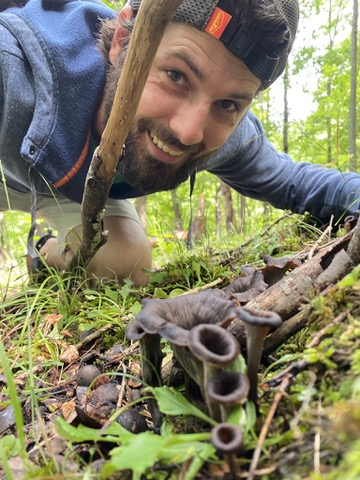

# Research

  

    
My background sits at the intersection of molecular ecology, biogeochemistry (carbon and nitrogen cycling), and land use and management. My scientific research has ranged from decoding the way genomes interact with land management at the field scale, to uncovering fundamental ecological processes at the global scale. I have designed a national scale sampling program for Soil Organic Carbon monitoring in the USDA. I have a deep technical skillset in scientific programming, and modeling natural systems, which I use to solve real world problems.

  

  

    
  

## Personal Interests

As a practicing agro-ecologist, my focus is on building self sustaining ecosystems that provide high value economic off-takes while supporting robust ecosystem function. For me, producing local genotype truffles on native nut crops fits this bill perfectly. The truffles form a mycorrhizal symbiosis that benefits the host plants. The hazelnuts, chestnuts, hickories, and oaks provide a resilient and calorific crop in addition to the underground harvest of the truffles. I intercrop with a variety of staples, including sunflower, corn, and beans to round out the production. I also intersperse perennial herbal products like mint, roman chamomile, ginseng, and goldenseal which support polinator diversity and provide additional revenue streams.

I enjoy cooking freshly harvested food and sharing the harvest with of good friends around a campfire. I'm also an avid forager of berries and wild mushrooms, and often find myself most at peace in the depths of the Monongahela National Forest.

## Published Works

  
Harnessing methods, data analysis, and near-real-time wastewater monitoring for enhanced public health response using high throughput sequencing

Wastewater-based analysis has emerged as a pivotal method for monitoring SARS-CoV-2 (SC2). Leveraging high-throughput sequencing on wastewater samples facilitates a comprehensive, population-level assessment of circulating and emerging SC2 variants within a community. This study meticulously evaluates the detection performance, variant calling accuracy, and the time taken from sample collection to public data release for wastewater SC2 monitoring. Two different SC2 target enrichment panels were employed,Illumina MiSeqand OxfordNanoporeTechnologies (ONT) GridION sequencing platforms for a robust analysis. Daily collection of routine raw grab and composite samples took place at awastewater treatmentplant (WWTP) site in Maryland,USA(MD) from mid-January 2022 to the end of June 2022. TotalNucleic Acid(TNA) was extracted from samples and target enrichment was executed using QIAseq DIRECT and NEBNext VarSkip Shortampliconkits, with subsequent sequencing on MiSeq or ONT GridION platforms, respectively. Obtained sequences was analyzed using customCFSANWastewater Analysis Pipeline (C-WAP). Raw sequence data and detailed metadata were submitted toNCBI(BioProject PRJNA757291) as it became available. Wastewater data successfully detected the onset of new variants BA.2, BA.2.12, BA.4.6, and BA.5 to the observed population. Notably,Omicronsub-variants were identified approximately a week ahead of publicly available clinical data at the MD ZIP-code level. Variation in quality metrics paralleled the rise and fall of BA waves, underscoring the impact ofviral loadon sequencing quality. Regular updates of estimated variant proportions were made available on the FDA-CFSAN "Wastewater Surveillance for SARS-CoV-2 Variants" website. In contrast to the median 28-day turnaround, the lead time from sample collection to public release of raw sequence data via NCBI was remarkably swift, accomplished within a mere 57 h in this specific exercise. Processing, sequencing, and analysis methods empowered the swift and accurate detection of SC2 trends and circulating variants within a community, offering insights for public health decision-making. https://doi.org/10.1016/j.envres.2025.121633

  
Quantitative Amplicon Sequencing Is Necessary to Identify Differential Taxa and Correlated Taxa Where Population Sizes Differ

High-throughput, multiplexed-amplicon sequencing has become a core tool for understanding environmental microbiomes. As researchers have widely adopted sequencing, many open-source analysis pipelines have been developed to compare microbiomes using compositional analysis frameworks. However, there is increasing evidence that compositional analyses do not provide the information necessary to accurately interpret many community assembly processes. This is especially true when there are large gradients that drive distinct community assembly processes. Recently, sequencing has been combined with Q-PCR (among other sources of total quantitation) to generate “Quantitative Sequencing” (QSeq) data. QSeq more accurately estimates the true abundance of taxa, is a more reliable basis for inferring correlation, and, ultimately, can be more reliably related to environmental data to infer community assembly processes. In this paper, we use a combination of published data sets, synthesis, and empirical modeling to offer guidance for which contexts QSeq is advantageous. As little as 5% variation in total abundance among experimental groups resulted in more accurate inference by QSeq than compositional methods. Compositional methods for differential abundance and correlation unreliably detected patterns in abundance and covariance when there was greater than 20% variation in total abundance among experimental groups. Whether QSeq performs better for beta diversity analysis depends on the question being asked, and the analytic strategy (e.g., what distance metric is being used); for many questions and methods, QSeq and compositional analysis are equivalent for beta diversity analysis. QSeq is especially useful for taxon-specific analysis; QSeq transformation and analysis should be the default for answering taxon-specific questions of amplicon sequence data. Publicly available bioinformatics pipelines should incorporate support for QSeq transformation and analysis.

  
Aligning agri-environmental subsidies and environmental needs: a comparative analysis between the US and EU

The global recognition of modern agricultural practices’ impact on the environment has fuelled policy responses to ameliorate environmental degradation in agricultural landscapes. In the US and the EU, agri-environmental subsidies (AES) promote widespread adoption of sustainable practices by compensating farmers who voluntarily implement them on working farmland. Previous studies, however, have suggested limitations of their spatial targeting, with funds not allocated towards areas of the greatest environmental need. We analysed AES in the US and EU—specifically through the Environmental Quality Incentives Program (EQIP) and selected measures of the European Agricultural Fund for Rural Development (EAFRD)—to identify if AES are going where they are most needed to achieve environmental goals, using a set of environmental need indicators, socio-economic variables moderating allocation patterns, and contextual variables describing agricultural systems. Using linear mixed models and linear models we explored the associations among AES allocation and these predictors at different scales. We found that higher AES spending was associated with areas of low soil organic carbon and high greenhouse gas emissions both in the US and EU, and nitrogen surplus in the EU. More so than successes, however, clear mismatches of funding and environmental need emerged—AES allocation did not successfully target areas of highest water stress, biodiversity loss, soil erosion, and nutrient runoff. Socio-economic and agricultural context variables may explain some of these mismatches; we show that AES were allocated to areas with higher proportions of female producers in the EU but not in the US, where funds were directed towards areas with less tenant farmers. Moreover, we suggest that the potential for AES to remediate environmental issues may be curtailed by limited participation in intensive agricultural landscapes. These findings can help inform refinements to EQIP and EAFRD allocation mechanisms and identify opportunities for improving future targeting of AES spending. DOI 10.1088/1748-9326/abfa4e

  
Components of N-fixation system response to glyphosate are un-coupled in agroecosystems

Glyphosate, introduced 50 years ago, is one of the most widely used herbicides. There are lingering concerns over the potential environmental impacts of glyphosate, prompting many studies. Many of these studies have isolated specific types of glyphosate effects – such as on N-fixation rate, ormicrobial communitydynamics – but have not examined how glyphosate effects behave in relationship to one another. In this study, we evaluated the effect of glyphosate on biological N-fixation,soil microbial communitydynamics, and soil nifH gene quantity within four types ofcrop managementsystems. Our hypothesis was that iffarm managementmediates the effects of glyphosate, then the effects of glyphosate on different N-fixing components of crop management systems should have coordinated effects; when one component is impacted, the others should be as well. We measured % N derived from the atmosphere (Ndfa) in soybean as a proxy for fixation, the quantity of16S rRNAmarker genes, and the nifH gene in Near soil (soil attached to roots) and Far soil (soil unattached, but under root influence) samples. We determined the response of putativediazotrophsto glyphosate in the Near and Far soil using a combination of Quantitative-Polymerase Chain Reaction (QPCR) and 16S geneamplicon sequencing. The crop management systems included two under conventional management (NT is No-till and CT is Chisel till) and two under organic rotations (O3 is a 3-year rotation, and O6 is a 6-year rotation). We found that glyphosate led to changes in some components, but that these effects were likely governed by separate mechanisms and did not behave in a coordinated manner. Glyphosate caused a decrease in Ndfaunder CT; the effect of glyphosate on Ndfaacross systems was weakly negatively correlated to the amount ofsoil organic matterin the crop management systems. The 16S rRNA gene abundance was not affected by glyphosate. Glyphosate caused a 217 % increase in nifH gene abundance in therhizosphere, but this effect was not affected by crop management system. Glyphosate treatment affected community composition only in the Near soil of O6. The assemblage of taxa that responded to glyphosate in each system differed and it is possible that dynamics in the population of 16S sequence variants is decoupled from the selective pressure of glyphosate treatment in soils. DOI: https://doi.org/10.1016/j.apsoil.2023.104859

  
Soil microbiomes in three farming systems more affected by depth than farming system

Agriculture, by its intentional design, manipulates the ecological functions of soils. It does so by altering carbon and nutrient inputs; by controlling the plant community; and in the case of tillage, by physically disrupting and redistributing the soil within the soil profile. While there are many studies that contrast soilmicrobiomesacrossfarming systems, few studies have examined the effect of farming system on the vertical organization of taxa in the soil profile. We hypothesized that large effects offarming systemsonedaphic factorswould lead to large impacts on themicrobial communitythat would reflect the underlying life history strategy of the microbes. For example, that tillage would increase the proportion of unicellular fungi. Our study compared farming systems that had been in place for 13 years in the mid-Atlantic region of the United States. Each system is a 3-year rotation ofcorn(Zea mays), soybean (Glycinemax), and wheat (Triticum aestivum), managed with either conventional no-till, conventional chisel-till, or using organic methods. We determined the relative effect of long-term farming system management onedaphic factorsand thesoil microbial communitywith depth structured sampling (0–5, 5–10, 10-Ap, Ap-30 cm). We found relatively small effects of farming system but substantial effects of depth on edaphic factors and microbial communities. For example, differences in management resulted in subtle differences in %C above the Ap horizon. Fungal gene abundance increased in the organic system relative to the no-till system, although neither fungal nor bacterial richness differed across farming systems. Farming system effects onmicrobial communitycomposition were greatest in the top 10 cm but did not affect the abundance of unicellular fungi. Several groups includingPseudomonasand Mortierellomycota appear to be sensitive to redistribution by tillage in the organic system, but it is not clear to what extent this effect is due to legacy DNA from tillage. DOI: https://doi.org/10.1016/j.apsoil.2022.104396

  
Soil microbial communities in diverse agroecosystems exposed to the herbicide glyphosate

Despite glyphosate’s wide use for weed control in agriculture, questions remain about the herbicide’s effect on soil microbial communities. The existing scientific literature contains conflicting results, from no observable effect of glyphosate to the enrichment of agricultural pathogens such asFusariumspp. We conducted a comprehensive field-based study to compare the microbial communities on the roots of plants that received a foliar application of glyphosate to adjacent plants that did not. The 2-year study was conducted in Beltsville, MD, and Stoneville, MS, with corn and soybean crops grown in a variety of organic and conventional farming systems. By sequencing environmental metabarcode amplicons, the prokaryotic and fungal communities were described, along with chemical and physical properties of the soil. Sections of corn and soybean roots were plated to screen for the presence of plant pathogens. Geography, farming system, and season were significant factors determining the composition of fungal and prokaryotic communities. Plots treated with glyphosate did not differ from untreated plots in overall microbial community composition after controlling for other factors. We did not detect an effect of glyphosate treatment on the relative abundance of organisms such as Fusariumspp.

  
Metagenomics reveals bacterial and archaeal adaptation to urban land-use: N catabolism, methanogenesis, and nutrient acquisition

Urbanization results in the systemic conversion of land-use, driving habitat and biodiversity loss. The “urban convergence hypothesis” posits that urbanization represents a merging of habitat characteristics, in turn driving physiological and functional responses within the biotic community. To test this hypothesis, we sampled five cities (Baltimore, MD, United States; Helsinki and Lahti, Finland; Budapest, Hungary; Potchefstroom, South Africa) across four different biomes. Within each city, we sampled four land-use categories that represented a gradient of increasing disturbance and management (from least intervention to highest disturbance: reference, remnant, turf/lawn, and ruderal). Previously, we used amplicon sequencing that targeted bacteria/archaea (16S rRNA) and fungi (ITS) and reported convergence in the archaeal community. Here, we applied shotgun metagenomic sequencing and QPCR of functional genes to the same soil DNA extracts to test convergence in microbial function. Our results suggest that urban land-use drives changes in gene abundance related to both the soil N and C metabolism. Our updated analysis found taxonomic convergence in both the archaeal and bacterial community (16S amplicon data). Convergence of the archaea was driven by increased abundance of ammonia oxidizing archaea and genes for ammonia oxidation (QPCR and shotgun metagenomics). The proliferation of ammonia-oxidizers under turf and ruderal land-use likely also contributes to the previously documented convergence of soil mineral N pools. We also found a higher relative abundance of methanogens (amplicon sequencing), a higher relative abundance of gene sequences putatively identified as Ni-Fe hydrogenase and nickel uptake (shotgun metagenomics) under urban land-use; and a convergence of gene sequences putatively identified as contributing to the nickel transport function under urban turf sites. High levels of disturbance lead to a higher relative abundance of gene sequences putatively identified as multiple antibiotic resistance protein marA and multidrug efflux pump mexD, but did not lead to an overall convergence in antibiotic resistance gene sequences. DOI: https://doi.org/10.3389/fmicb.2019.02330

  
Urbanization leads to the loss of ectomycorrhizal fungal diversity and the convergence of archaeal and fungal soil communities

Urbanization alters the physicochemical environment, introduces non-native species and causes ecosystem characteristics to converge. It has been speculated that these alterations contribute to loss of regional and global biodiversity, but so far most urban studies have assessed macro-organisms and reported mixed evidence for biodiversity loss. We studied five cities on three continents to assess the global convergence of urban soil microbial communities. We determined the extent to which communities of bacteria, archaea and fungi are geographically distributed, and to what extent urbanization acts as a filter on species diversity. We discovered that microbial communities in general converge, but the response differed among microbial domains; soil archaeal communities showed the strongest convergence, followed by fungi, while soil bacterial communities did not converge. Our data suggest that urban soil archaeal and bacterial communities are not vulnerable to biodiversity loss, whereas urbanization may be contributing to the global diversity loss of ectomycorrhizal fungi. Ectomycorrhizae decreased in both abundance and species richness under turf and ruderal land-uses. These data add to an emerging pattern of widespread suppression of ectomycorrhizal fungi by human land-uses that involve physical disruption of the soil, management of the plant community, or nutrient enrichment.

